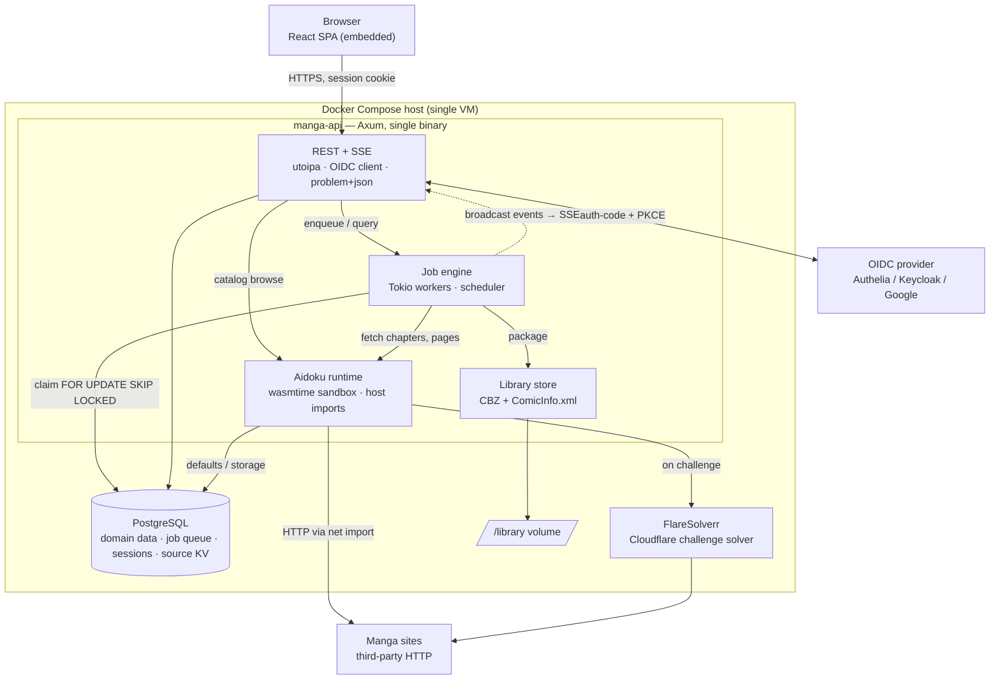

# Backend

Here's the container view of what you've chosen, then the full spec.



## Backend architecture — v1

### Decisions locked

| Area | Choice |
|---|---|
| Framework | Axum + tower middleware, utoipa for OpenAPI 3.1 |
| Data | PostgreSQL, SeaORM + sea-orm-migration |
| Jobs | In-process Tokio workers, Postgres-backed queue |
| Providers | Aidoku `.aix` sources via wasmtime; `Source` trait allows native adapters |
| Auth | OIDC authorization-code + PKCE (`openidconnect` crate), server session cookie |
| Realtime | SSE (`GET /api/v1/events`) |
| Storage | Local volume, CBZ + ComicInfo.xml per chapter |
| Cloudflare | FlareSolverr sidecar |
| Frontend | Built React embedded via `rust-embed`, same origin |
| Repo | Cargo workspace monorepo + `web/` |
| Observability | OpenTelemetry |

### Workspace layout (hexagonal)

```
crates/
  domain/          entities, value objects, ports (traits), use cases — no I/O deps
  api/             Axum routes, DTOs, utoipa, OIDC, SSE, static embed; main.rs
  persistence/     SeaORM entities + repository adapters implementing domain ports
  jobs/            queue adapter, worker pool, scheduler, job handlers
  aidoku-runtime/  wasmtime host, .aix loader, host imports; implements domain::Source
  packaging/       CBZ writer, ComicInfo.xml, library path layout
web/               React app (Vite), generated client from openapi.json
```

Dependency rule: everything points inward to `domain`. `api` composes the graph in `main.rs`. Provider ports in `domain`: `SourceCatalog` (list/search/filters), `SourceItem` (details, chapters, pages), `SourceRegistry` (install/update from repo index). Storage port: `LibraryStore`. Queue port: `JobQueue`.

### Domain model

`source_repo` → `source` (installed .aix, version, kv namespace) → `manga` (item; source_id + external key, metadata, cover) → `chapter` (subitem; number, volume, published_at, external key) → `downloaded_chapter` (path, size, checksum, packaged_at). `follow` (manga_id, check interval, last_checked, auto-download flag). `job` (see below). `user` (OIDC subject + issuer), `session`. `source_kv` (per-source defaults/settings the WASM host reads/writes). Library is shared; `user` exists only for identity and audit.

### Job engine

- Table `job(id, kind, payload jsonb, state, priority, run_at, attempts, max_attempts, locked_by, locked_at, last_error, idempotency_key unique)`.
- States: `queued → running → succeeded | failed | cancelled`; `failed` with attempts left → back to `queued` with exponential backoff + jitter.
- Claim: `UPDATE job SET state='running', locked_by=$w ... WHERE id = (SELECT id FROM job WHERE state='queued' AND run_at<=now() ORDER BY priority, run_at FOR UPDATE SKIP LOCKED LIMIT 1) RETURNING *`.
- Kinds: `download_chapter`, `package_chapter`, `refresh_metadata`, `check_follow`, `update_sources`. `download_chapter` fans out page fetches inside the handler with a `Semaphore` per source (default 2–4 concurrent) to respect rate limits.
- Scheduler: a single Tokio task ticks every minute, enqueues `check_follow` for due follows and `update_sources` daily. Deferred downloads are just jobs with a future `run_at`.
- Progress: handlers publish `JobEvent` to a `tokio::sync::broadcast`; the SSE handler subscribes and streams `job.progress`, `job.state`, `chapter.new` events. On reconnect the client passes `Last-Event-ID`; events are also persisted briefly so a page reload doesn't lose state.
- Recovery: on startup, jobs `running` with a stale `locked_at` are reset to `queued`.
- Graceful shutdown: SIGTERM → stop claiming, wait up to N seconds for in-flight jobs, then exit.

### aidoku-runtime

- Loads `.aix` (zip: manifest, `main.wasm`, filters/settings JSON). Caches compiled modules with wasmtime's on-disk cache.
- One `Store` per invocation, pooled `Engine`. Limits: memory cap (~64–128 MB), epoch-based timeout, fuel optional.
- Host imports to implement (mirror AidokuRunner): `net` (HTTP with cookie jar → reqwest; on challenge detection route through FlareSolverr and cache its clearance cookies/UA per domain), `html` (parsing/selectors **and mutation** → `html5ever` + RC-DOM or `kuchikiki`; `scraper` is read-only and cannot back this module — ADR-0004), `defaults`/`storage` (→ `source_kv`), `std` (string/date helpers), `js` **context functions only** (rquickjs, when a source requires it — the `webview_*` imports need a real browser engine and are a declared gap), `canvas` deferred as a declared capability gap. Refuse installation of sources requiring unimplemented imports (ADR-0004).
- Models decoded from postcard; keep the Rust structs aligned to the aidoku-rs version you target and version the ABI so updated sources don't silently break.
- Run sync WASM invocations on `spawn_blocking`; host HTTP inside uses a blocking client to keep the ABI simple. Alternative: wasmtime async + async host funcs — more elegant, more surface area. Recommend starting blocking.

### API surface (`/api/v1`)

- `auth`: `GET /auth/login`, `GET /auth/callback`, `POST /auth/logout`, `GET /me`
- `source-repos`: CRUD; `POST /source-repos/{id}/refresh`
- `sources`: `GET`, `POST /sources` (install from repo entry), `DELETE`, `GET/PUT /sources/{id}/settings`, `GET /sources/{id}/filters`
- `sources/{id}/catalog`: `GET ?q=&filters=&cursor=` (listing/search), `GET /sources/{id}/manga/{key}`, `.../chapters`
- `manga`: library-side `GET /manga`, `GET /manga/{id}`, `GET /manga/{id}/chapters`, `POST /manga` (add to library from source key)
- `follows`: CRUD; `POST /follows/{id}/check-now`
- `downloads`: `POST /downloads` (`{chapter_ids, run_at?}`, `Idempotency-Key`) → `202` + `Location`; `GET /downloads/{chapter_id}/file` (streams CBZ)
- `jobs`: `GET ?state=&cursor=`, `GET /{id}`, `POST /{id}/cancel`, `POST /{id}/retry`
- `events`: SSE stream
- `openapi.json`, `/healthz`, `/readyz`

Conventions: problem+json errors, cursor pagination, ETag/If-None-Match on reads, `Retry-After` on 429/503, RFC 3339 timestamps, snake_case JSON.

## Backend — Observability & OpenTelemetry

### Scope

Backend telemetry stays `tracing` → JSON on stdout (no collector, no OTLP export in v1), but it is structured so that (a) frontend traces correlate with backend request logs through W3C Trace Context, (b) the frontend's OTel spans are ingested through the API and land in the same log stream, and (c) switching to a real OTLP pipeline later is a config change, not a refactor.

### Crates

| Purpose | Crate |
|---|---|
| Instrumentation | `tracing`, `tracing-subscriber` (`env-filter`, `json`), `tracing-error` |
| OTel semantics & propagation | `opentelemetry`, `opentelemetry_sdk`, `tracing-opentelemetry` |
| HTTP layer | `tower-http::trace::TraceLayer` (custom `MakeSpan`), `axum-tracing-opentelemetry` or a hand-rolled extractor for `traceparent` |
| Optional export (feature-gated) | `opentelemetry-otlp` behind `--features otlp` |
| Ingest payload | `opentelemetry-proto` with `gen-tonic-messages` + `with-serde` to deserialize OTLP/JSON |
| Errors | `anyhow`/`thiserror` + `tracing::error!` with `error.type`, `error.message` fields |

### Subscriber setup

```
Registry
  ├─ EnvFilter          RUST_LOG, default "info,manga_api=debug,sea_orm=warn,hyper=warn"
  ├─ ErrorLayer         SpanTrace capture for error reports
  ├─ OpenTelemetryLayer TracerProvider with no exporter in v1 (creates span/trace ids,
  │                     honours propagated context); OTLP exporter when feature `otlp`
  └─ fmt::layer().json() flatten_event(true), with span list, current_span, target,
                        file/line only at debug, RFC 3339 timestamps, `service.*` resource fields
```

Every JSON line carries `trace_id` and `span_id` copied from the OTel context via a small custom `Layer` (or `tracing-opentelemetry`'s `OpenTelemetrySpanExt` in the `MakeSpan`), so logs are joinable even without an exporter. Resource attributes: `service.name=manga-api`, `service.version` (from `CARGO_PKG_VERSION` + git SHA via `vergen`), `deployment.environment.name` (ADR-0015).

### Span model

- HTTP server span per request (`http.server.request`): `http.request.method`, `http.route` (the low-cardinality route template; `url.path` is the raw path and is a different, high-cardinality attribute — ADR-0015), `http.response.status_code`, `client.address` (from `X-Forwarded-For` only if behind trusted proxy), `user.id` (OIDC `sub`, hashed), `session.id` (hashed). Extracts `traceparent`/`tracestate`; if absent, starts a new trace. Response includes `traceparent` so the SPA can show a trace id on its crash page.
- Handler spans via `#[tracing::instrument(skip(...), fields(...))]` on use cases in `domain`, not on Axum handlers; DTO parsing errors are events on the server span.
- DB spans: SeaORM statement logging is disabled in favor of a `sqlx` `log_statements(Debug)` for slow queries (> 250 ms) only; each repository method is instrumented with the stable names `db.system.name=postgresql`, `db.operation.name`, `db.collection.name`, plus `db.query.summary` as the span name (ADR-0015). SeaORM exposes the threshold directly via `ConnectOptions::sqlx_slow_statements_logging_settings`.
- Job spans: each job execution is a root span `job.run` with `nyuka.job.id`, `nyuka.job.kind`, `nyuka.job.attempt`, `nyuka.source.id`, `nyuka.manga.id`, `nyuka.chapter.id` (custom attributes carry the `nyuka.` prefix to avoid collision with future semantic conventions — ADR-0015), linked (`span link`) to the trace that enqueued it, whose `trace_id` is stored in `job.payload.trace_context`. Page fetches are child spans with `http.client.*` attributes and `source.id`; FlareSolverr detours get their own span with `nyuka.cf.challenge=true`.
- WASM spans: `aidoku.call` with `nyuka.source.id`, `nyuka.source.version`, `nyuka.aidoku.fn` (`get_manga_list`, `get_chapter_list`, …), `nyuka.wasm.duration_ms`, `nyuka.wasm.memory_peak_bytes`. Use epoch-based interruption rather than fuel (ADR-0004), so there is no `fuel_used`. Host imports emit debug events, not spans, to keep volume down.
- SSE: one long-lived span per connection (`sse.connection`), events at connect/disconnect with `nyuka.sse.events_sent`.

### Metrics (log-derived in v1)

No Prometheus endpoint by decision. Instead a `metrics` module emits periodic `tracing::info!(target: "metrics", ...)` snapshots every 60 s: `jobs.queued`, `jobs.running`, `jobs.failed_1h`, `jobs.p95_duration_ms` by kind, `downloads.bytes_total`, `sse.connections`, `wasm.instances_active`, `db.pool.in_use`, `disk.library_free_bytes`. These lines are grep-able and can be scraped later with `vector`/`alloy` log→metric conversion if you change your mind. Health endpoints: `/healthz` (process up) and `/readyz` (DB reachable, migrations current, library volume writable, FlareSolverr reachable or degraded flag).

### Frontend telemetry ingest — `POST /api/v1/telemetry`

- Accepts `application/json` (OTLP/JSON `ExportTraceServiceRequest`) and `application/x-protobuf`; max body 256 KB; requires a valid session; rate-limited per session (e.g. 30 req/min, `tower_governor`) and per IP.
- Validation: reject unknown resource `service.name` (must be `manga-web`), cap spans per batch (200), cap attribute count/size, strip attributes not in an allow-list (`http.*`, `url.*`, `exception.*`, `browser.*`, `app.*`), truncate strings to 1 KB, drop anything resembling PII (`user.email`, query strings with tokens).
- Each span becomes one `tracing::info!(target: "web_telemetry", ...)` event with `otel.name`, `trace_id`, `span_id`, `parent_span_id`, `duration_ms`, `status`, attributes flattened, plus `session.id` (hashed) from the server side, not from the client. Exceptions become `tracing::error!` with `exception.type/message/stacktrace`.
- Returns `202 Accepted` with an empty OTLP response body; `429` with `Retry-After` when throttled; never `5xx` to the client for validation failures (`400` problem+json).
- When feature `otlp` is enabled the same endpoint forwards the batch to the configured collector instead of logging, so the frontend never changes.

### Correlation end to end

1. SPA fetch instrumentation injects `traceparent` into `/api/v1/*` calls.
2. Axum server span continues that trace; job enqueue stores the context; the worker links to it.
3. Both the API request log and the later `job.run` logs share the original `trace_id`; the SPA's own spans for that interaction arrive via the ingest endpoint under the same `trace_id`.
4. On error, the SPA shows the `trace_id` from the `traceparent` response header; `grep <trace_id>` on the container logs shows the full story.

### Configuration

| Env | Default | Notes |
|---|---|---|
| `RUST_LOG` | `info,manga_api=debug` | EnvFilter directives |
| `LOG_FORMAT` | `json` | `pretty` for local dev |
| `OTEL_SERVICE_NAME` | `manga-api` | standard OTel var |
| `OTEL_TRACES_SAMPLER` / `_ARG` | `parentbased_traceidratio` / `0.1` | only affects export when `otlp` is on; logs are never sampled |
| `OTEL_EXPORTER_OTLP_ENDPOINT` | unset | enables export when set and binary built with `otlp` |
| `TELEMETRY_INGEST_ENABLED` | `true` | kill switch for the frontend endpoint |
| `TELEMETRY_INGEST_MAX_BODY_BYTES` | `262144` | |
| `TRUSTED_PROXIES` | empty | CIDRs allowed to set `X-Forwarded-*` |

Secrets never appear in spans: a `tracing` field-redaction layer masks values for keys matching `authorization|cookie|set-cookie|token|secret|password`, and `reqwest` client spans record the URL host and path only.

### Log shipping and retention

Compose: Docker `json-file` driver with `max-size=50m`, `max-file=10`. Optional `vector` sidecar later for shipping to Loki or S3. Structured fields make `docker logs manga-api | jq 'select(.trace_id=="…")'` the day-one debugging workflow.

### Alternative considered

Full OTLP from the start (backend + frontend → `otel-collector` → Grafana Tempo/Loki/Prometheus). Better querying and metrics with real dashboards, but three to four extra containers, more RAM on a single VM, and a browser-reachable collector to secure. Deferred; the feature flag and the ingest endpoint keep the migration path open.

### ADRs

See [`docs/adr/`](docs/adr/README.md). The observability decisions are split three ways: [0015](docs/adr/0015-adopt-opentelemetry-semantics-as-the-instrumentation-model.md) the instrumentation model (read first), [0014](docs/adr/0014-keep-backend-telemetry-as-structured-logs.md) log-only with no collector, [0013](docs/adr/0013-ingest-frontend-telemetry-through-the-api.md) frontend ingest.

Pin all OpenTelemetry crates to the **0.32** line: `tracing-opentelemetry` 0.33 and `axum-tracing-opentelemetry` 0.39 both require `opentelemetry ^0.32`, even though `opentelemetry` itself is published at 0.33. Note also that traces are the *beta* part of the Rust SDK — logs and metrics are stable — which is a further reason not to export in v1.

### Auth details

Backend as OIDC client with PKCE and `state`/`nonce`; session stored in Postgres (`tower-sessions`), cookie `HttpOnly; Secure; SameSite=Lax`. Because frontend is same-origin, no CORS; add CSRF protection for mutating requests anyway (custom header check `X-Requested-With` or double-submit token). Refresh the IdP token server-side if you need to show `me`; otherwise the session lifetime is your own. Allow-list which OIDC subjects/groups may log in (config).

### Security

- Secrets (`OIDC_CLIENT_SECRET`, `DATABASE_URL`, `SESSION_KEY`) via Docker secrets / env injected from a vault; never in the image.
- WASM is untrusted: sandbox limits above, no WASI filesystem/sockets — sources only reach the network through your `net` host import, which enforces an allow-list (no requests to `localhost`, RFC1918, cloud metadata).
- Zip-slip and path traversal: sanitize titles into paths, write into a temp dir, then atomic rename.
- `cargo-deny` (licenses, advisories), `cargo-audit`, `clippy -D warnings`, Trivy on the image in CI.
- Rate limit `/auth/*` and source catalog calls per session (`tower_governor`).

### Storage layout

```
/library/
  <Series Title>/
    cover.jpg
    series.json                 (this application only; not read by other tools)
    <Series Title> v03 c021.cbz (ComicInfo.xml v2.0 inside)
```

### Runtime & delivery

Compose: `api` (healthcheck `/readyz`), `postgres:17` (volume + nightly `pg_dump` sidecar or cron), `flaresolverr`, `caddy` for TLS — **recommended, not optional**: without HTTP/2 an SSE stream occupies one of the browser's six HTTP/1.1 connections per origin and the seventh request of any kind queues silently (ADR-0010). Config via env with `figment` or `config` crate, validated fail-fast at startup. Migrations run on boot. Multi-stage Dockerfile: `node` builds `web/`, `rust` builds with the assets embedded, `distroless`/`debian-slim` runtime. CI as stated earlier; images tagged by git SHA and semver. Rollback = redeploy previous tag; SLO to define before prod: job success rate and time-to-first-page.

### ADRs

Written up in [`docs/adr/`](docs/adr/README.md): [0001](docs/adr/0001-use-axum-for-the-http-api.md) Axum, [0002](docs/adr/0002-use-seaorm-for-persistence.md) SeaORM, [0003](docs/adr/0003-run-the-job-queue-in-postgres-and-in-process.md) Postgres in-process job queue, [0004](docs/adr/0004-use-aidoku-wasm-sources-as-the-provider-mechanism.md) Aidoku WASM sources, [0005](docs/adr/0005-act-as-the-oidc-client-with-server-side-sessions.md) backend as OIDC client, [0006](docs/adr/0006-embed-the-frontend-in-the-binary.md) embedded frontend, [0007](docs/adr/0007-store-the-library-as-cbz-files-on-a-local-volume.md) CBZ on a local volume.

Two constraints those records surfaced, both worth knowing before writing code:

- **Hand-write the job queue and the session store.** Every candidate crate — `apalis-sql` 0.7, `sqlxmq`, `underway`, `tower-sessions-sqlx-store`, `tower-sessions-seaorm-store` — requires SQLx 0.8 or SeaORM 1.1, which are semver-incompatible with SeaORM 2.x on SQLx 0.9. Adopting any of them means a second connection pool and no shared transaction. (`apalis-postgres` 1.0-rc *is* on SQLx 0.9 and is the one to revisit when it ships stable.)
- **`openidconnect` 4.0.1 brings RUSTSEC-2023-0071** (`rsa` Marvin attack, still unpatched) into the tree, so `cargo-deny` fails on the first commit that adds it. The vulnerable path is RSA *private-key* operations, which an RP verifying `RS256` does not exercise — so use `client_secret_basic`/`client_secret_post`, disable encrypted ID tokens, and record an exception with that reasoning, an owner, and a review date.

### Open items

Three of the four are now settled:

- ~~Target `aidoku-rs` ABI version (0.7-era vs latest)~~ — **there is no version to pin.** The `aidoku` crate is 0.3.0 with `publish = false` and no git tags; sources consume it by git dependency. Pin a **commit SHA** in `crates/aidoku-runtime`, define your own `HOST_ABI_VERSION` in the module cache key, and build a conformance `.aix` at that SHA (ADR-0004).
- ~~Per-source concurrency caps~~ — **sources declare their own** via the `net::set_rate_limit(permits, period, unit)` host import. Take the stricter of the declared limit and the configured cap (ADR-0004).
- ~~Cancelling a running download: delete partials or keep for resume~~ — **the question mostly dissolves.** Atomic rename means nothing partial is ever visible in the library, so only the temp directory is at stake: delete it on cancel, treat resume as a future feature (ADR-0007).
- ~~Multiple library roots or one~~ — **one configurable root in v1.** Multiple roots are five product questions, not a setting; `LibraryStore` is shaped so a second root is addable later (ADR-0007).

Still open:

- **Follow-check cadence defaults.** What interval a new follow gets, and whether it varies by source update frequency.
- **The two SLOs**, deferred by this document and needed before production: job success rate and time-to-first-page. Time-to-first-page is also the input that decides whether the job queue ever needs `LISTEN`/`NOTIFY` (ADR-0003), and window-based SLO evaluation is the weakest point of log-only telemetry (ADR-0014).
- **Which `.aix` sources v1 must support.** Reading their required host imports is what scopes the runtime work, and doing it before writing host code is the highest-leverage step available (ADR-0004).
